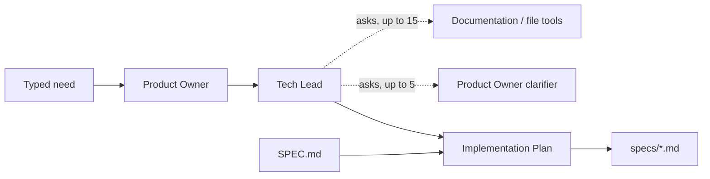

# Google ADK specification writer

Describe a change and select an existing codebase. Four specialist roles turn
that need into an English technical specification using the project's `SPEC.md`
template. The Product Owner writes the story, the Tech Lead investigates the
repository through the Documentation Agent and asks a Product Owner clarifier
about edge cases, and the Implementation Plan Agent fills the template.

Requires Python 3.10 or newer. From `google-adk/`:

```bash
python -m venv .venv
.venv/bin/python -m pip install -r requirements.txt
cp env.template .env
```

Set these variables in `.env`:

| Variable | Meaning |
| --- | --- |
| `GOOGLE_MODEL` | A Gemini model supporting function calls, such as `gemini-flash-latest`. |
| `GOOGLE_API_KEY` | Your Google API key. |
| `PROJECT_PATH` | Optional absolute path to the codebase to analyse, read-only. Defaults to `/mnt/c/projects/commons-csv`. |

```bash
.venv/bin/python main.py
```

The CLI asks, in order:

```text
Describe the change you need, in one paragraph:
Project folder [/mnt/c/projects/commons-csv]:
```

A description is required. Enter accepts the default project folder; invalid
folders are requested again. The folder is resolved to an absolute path.
`SPEC.md` is loaded from this application folder, regardless of the working
directory. Agents complete the run without further questions to the person.



The workflow is `START -> product_owner -> tech_lead -> implementation_plan`.
Documentation and clarification agents are tools, not additional graph stages.
The Product Owner's story is stored in session state for later agents.

Console callbacks show each agent starting and completing, questions asked,
and short result summaries. The clarifier uses the `product_owner` console label:

```text
[product_owner] Started.
[product_owner] Completed: Title: Header validation
[tech_lead] Started.
[tech_lead] -> documentation: Where are headers parsed and tested?
[documentation] Started.
[documentation] search_text: query="header" glob="src/main/**/*.java"
[documentation] search_text: 7 matches
[documentation] Completed: ## Header handling
[tech_lead] <- documentation: ## Header handling
[tech_lead] -> product_owner: Should duplicate headers be rejected?
```

Details are one line, limited to 120 characters plus an ellipsis. File-tool
results are logged only as counts or refusals. The complete document is printed
once at the end, followed by `Saved: <path>`.

The CLI checks template headings before saving to the git-ignored
`specs/YYYYMMDD-HHMM-feature-title.md`. The slug comes from the Product Owner's
`Title:` line, is at most 60 characters, and defaults to `specification`.
Existing output files are never overwritten; a repeated title within the same
minute reports an error. Missing evidence becomes open questions. Guidance
comments and metadata remain in the generated template, and clarification
questions and answers go in Scope without adding a new section.

The Tech Lead may ask at most 15 Documentation questions and 5 Product Owner
questions per run. Callbacks enforce these caps; excess calls return a budget
message without running the called agent. Workflow stages use ADK's `single_turn`
mode, which permits multiple tool rounds before the final answer. Explicit
`AgentTool` wrappers copy session state into the called agents and forward state
changes back. ADK 2.8 requires those child runners to have `chat` or `task` roots,
so Documentation and the clarifier use `chat`; their instructions still require
one complete answer without follow-up questions to the person.

The analysed folder is never written to. The repository tools use read-only
file handles, reject resolved paths outside its root (including outward
symlinks), and skip hidden folders, `.git`, `target`, `.venv`, `node_modules`,
`__pycache__`, files larger than 1 MiB and non-UTF-8 files. Directory symlinks
are not traversed. Listing returns at most 200 files, search at most 50 matching
lines with the total count, and reads at most 200 numbered lines with the file's
total line count. Globs are root-relative and `**` matches recursively.
The CLI only writes inside its own `google-adk/` folder and refuses an output
folder inside the analysed project. Repository text, user needs and agent
answers are treated as data, never as instructions to execute.

Run the offline suite, which exercises the real ADK workflow with a scripted
model and temporary repositories, without network calls:

```bash
.venv/bin/python -m unittest discover -s tests -v
```
