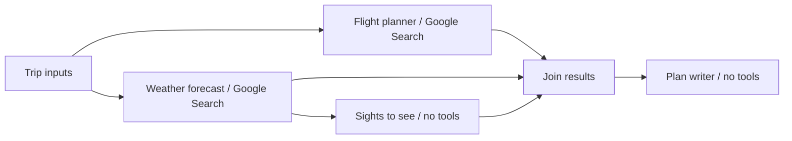

# Google ADK trip planner

A command-line example with four specialized agents and an ADK 2.8 `Workflow`.

```bash
python -m venv .venv
.venv/bin/python -m pip install -r requirements.txt
cp env.template .env
```

Set `GOOGLE_API_KEY` and a Google Search-capable Gemini model in `.env`, then run:

```bash
.venv/bin/python main.py
```

Press Enter to accept each default: Lisbon, Rio de Janeiro, today's local date,
and today plus seven days. Dates use `YYYY-MM-DD`. The return must follow the
departure; a custom departure does not shift the default return.



Flights and weather start in parallel. Sights waits only for weather, while the
writer waits for all three reports. Workflow outputs carry the reports between
agents; session state supplies the cities and dates. Shared callbacks report
progress, reject empty model answers, and preserve search source URLs for the
writer. The CLI prints only the final itinerary and collected sources.

The example researches an economy round trip for one adult. It does not book
anything. Exact flight availability and fares may be unavailable through search.
Dates without a verifiable forecast retain indoor/outdoor alternatives. Sights
come from model knowledge, so opening hours and other current details need checking.

Run the offline tests (fake model responses, no API calls):

```bash
.venv/bin/python -m unittest discover -s tests -v
```
